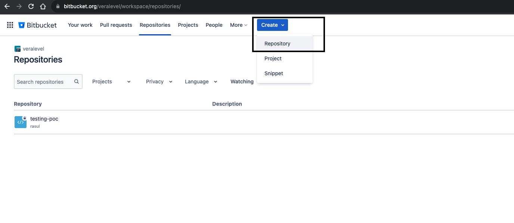

# Go App CI/CD Pipeline

This CI/CD Pipeline will Scan Build Deploy Go web application to EKS Cluster.

CI/CD Pipeline Steps:

- Create & Setup Repo
- Pipeline Steps 
- Kube manifest for deployment
- Repository Variables Setup
- Commit & Run

## Quick Start

Create & Setup Repo:

To create a new repo in bitcket
Go to repositories page --> select create drop down --> select repository
<p align="center">

</p>
Add appropriate settings like repo name and mandatorily select private access.
<p align="center">

</p>
Generate SSH Key and add in the repo for clone access:

```console
$ ssh-keygen 
$ cat ~/.ssh/id_rsa.pub
```
<p align="center">

</p>

Finally run a ssh command from your local to get authenticated with bitbucket

```console
$ ssh git@bitbucket.org
```

Now we can clone the repo from our local by repo SSH URL as below.

<p align="center">

</p>

Then using the URL you can simply clone by command line

```console
$ git clone git@bitbucket.org:veralevel/testing-poc.git
```


Pipeline Steps:

First you have to create file name called bitbucket-pipelines.yml(in Root Dir) file which is an default bitbucket pipeline config file

[First-Pipeline-Script-For- Reference](https://support.atlassian.com/bitbucket-cloud/docs/configure-your-first-pipeline/)

This file Includes the following steps:

Step-1: Lint Code: For go we have a tool called go lint available which will completely review about our code standard.
        By this step it will analyse our code and will give the output like below.
<p align="center">

</p>

Step-2: GoSec: Using gosec we are running security test against the code. So that all security valnurabilities will be validated here.

<p align="center">

</p>

Step-3: Lint DockerFile: We are reviewing our Dockerfile here to check if any more recommended improven needed

<p align="center">

</p>

Step-4: Docker Build: Here we are building a Docker image for our application and saving the image as an TAR artifact
Actually when we are building the Docker image Its doing go lang app Build come Docker Image Build
We achieved this two builds in single step by multi containers in docker file.
Please review on Dockerfile which is in Root Directory of the code.

<p align="center">

</p>

Step-5: Docker Push: Once docker image is built on the previous step its artifact as tar file and taken to here.
Here we are Tagging the Docker file and pushing to the private dockerhub.
All the creds and secret details are defined as params and we decalred this variable and value in repository variables.
We will cover this repository variables in the upcoming steps.

Example: $DOCKERHUB_NAME we used in the step and the variable DOCKERHUB_NAME we set on repository variables. 

<p align="center">

</p>

Step-6: Deploy to EKS: We used awscli & kubeclt pre installed image(bearengineer/awscli-kubectl)
Here we just setting up the kubectl credentials by awscli and running kubernetes manifest deploy.yaml againt EKS cluster.

- export AWS creds
- aws cli to update kubeconfig
- kubectl get pods to test the connectivity
- download and make it executable envsubst for pass env vars to manifest
- Finally Kubectl apply to configure changes in Cluster

<p align="center">

</p>


Kube manifest for deployment:

Here as a startup we used the basic deployment kind with three replicas. Its just grabbing the built docker image from the private dockerhub and deploying in default namespace.

You can review the code here. ./kubernetes/manifests/deploy.yaml. Further you can develop with helm charts.


Repository Variables Setup:

We used lot of Vars in the bitbucket config file(bitbucket-pipelines.yml). The Vars are defined as

- Deafult Bitbucket Vars. EX: BITBUCKET_REPO_SLUG --> This all are automatically generated value from bitbucket pipeline
- Declared Vars. EX: DOCKERHUB_PASSWORD --> We imported this variables and values in bitbucket repo vars.

Here how: Code --> Repository Settings --> Pipelines --> Repository Variables --> declare vars --> add

<p align="center">

</p>


